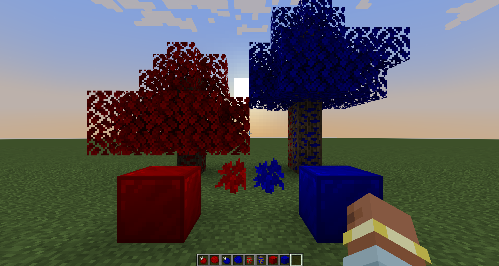
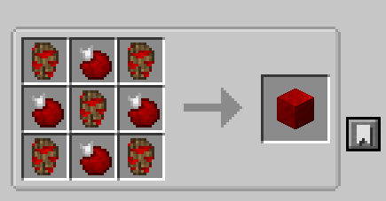
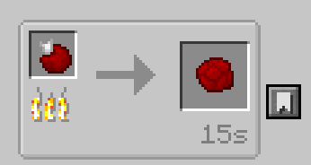

# Configurable OreTrees

This is a Mod for Modpack creators.

This mod allows the creation of custom Ore Trees, which the Modpack creator can later add uses for.

It can easily create trees, fruit, bark and logs with a few lines of config (id + color).

There is builtin support for BonsaiTrees 3 and BotanyPots

This Mod doesn't provide a way to generate ores by default. 
It only has a way to generate acorns/resin/amber.
To get ores, the Modpack creator has to add recipes!

